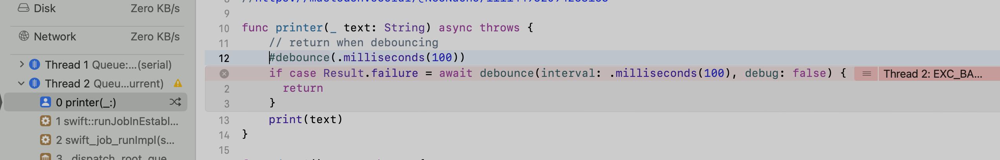

# macro-bad-access

Run the binary, if it doesn't crash right away just run it few times in a row. I have it crashing in Xcode 15.0 and 15.1

I've implemented the same logic with actors and locks, throwing errors and returning a result, controlling the flow with guard vs if... but it consistently compiles ok but crashes at runtime. 

The tests showcase the expected expansions.

I haven't seen the crash happen in tests.

Additionally, some of the generated source is lost in testMacroConfig() or the expansion doesn't work the same way in tests and in "real" code 🤦🏽‍♂️
